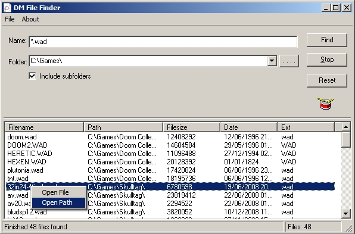



## DM File Finder v1\.0

### Description

Hi, This is a simple and basic File serach tool I made for my self cos I do not like Vista new serach tool, anyway it easy to use and can Serach by filename or patten eg *.exe, it can also serach in a single folder or subfolders and display the results. anyway Hope you like it
 
### More Info
 

             |
---                |---
**Submitted On**   |2008-12-14 13:54:30
**By**             |[dreamvb](https://github.com/Planet-Source-Code/PSCIndex/blob/master/ByAuthor/dreamvb.md)
**Level**          |Beginner
**User Rating**    |4.3 (13 globes from 3 users)
**Compatibility**  |VB 6\.0
**Category**       |[Files/ File Controls/ Input/ Output](https://github.com/Planet-Source-Code/PSCIndex/blob/master/ByCategory/files-file-controls-input-output__1-3.md)
**World**          |[Visual Basic](https://github.com/Planet-Source-Code/PSCIndex/blob/master/ByWorld/visual-basic.md)
**Archive File**   |[DM\_File\_Fi21372512152008\.zip](https://github.com/Planet-Source-Code/dreamvb-dm-file-finder-v1-0__1-71531/archive/master.zip)

